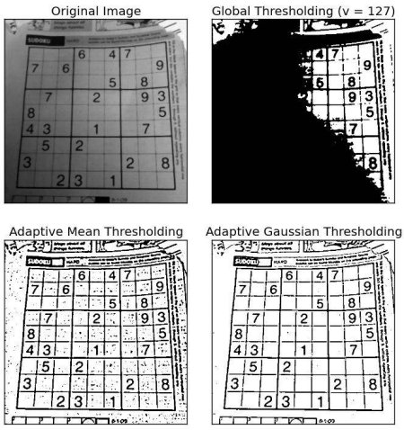

# Partage de connaissance
## Cristian Perez
### 28 février 2017

---

## Anatomy of an image classifier

{ width=100% }

---

# Preprocessing 

+++

## Deskew

Align an image to a reference assits the classification algorithm 
[1](http://docs.opencv.org/trunk/dd/d3b/tutorial_py_svm_opencv.html),
[2](https://www.learnopencv.com/handwritten-digits-classification-an-opencv-c-python-tutorial/).

{ height=100% }

+++

Deskewing simple grayscale images can be achieved using image moments (distance and intensity of pixels). 


```python
def deskew(img):
    m = cv2.moments(img)
    if abs(m['mu02']) < 1e-2:
        # no deskewing needed. 
        return img.copy()
    # Calculate skew based on central momemts. 
    skew = m['mu11']/m['mu02']
    # Calculate affine transform to correct skewness. 
    M = np.float32([[1, skew, -0.5*SZ*skew], [0, 1, 0]])
    # Apply affine transform
    img = cv2.warpAffine(img, M, (SZ, SZ), flags=cv2.WARP_INVERSE_MAP | cv2.INTER_LINEAR)
    return img
```

+++

### Not that easy for fishes


+++

## Histogram equalization

Increase image contrast using the image's histogram.

{ width=100% }


+++

Palette change by  a transformation function which maps the input pixels in
brighter region to the output pixels in full region.


```python
img = cv2.imread('wiki.jpg',0)
equ = cv2.equalizeHist(img)
res = np.hstack((img,equ)) #stacking images side-by-side
cv2.imwrite('res.png',res)
```


+++

- Histogram equalization considers the global contrast of the image
- The background contrast improves after histogram equalization, but the face
  of statue lost most of the information there due to over-brightness.

{ height=30% }
[1](http://docs.opencv.org/3.1.0/d5/daf/tutorial_py_histogram_equalization.html)

+++

### Adaptive Histogram Equalization

- Histogram is equalized inside blocks. 
- Histogram would confine to a small region (unless there is noise).
- If noise is there, it will be amplified. To avoid this, contrast limiting is applied.
- If any histogram bin is above the specified contrast limit (by default 40 in OpenCV), those pixels are clipped and distributed uniformly to other bins before applying histogram equalization. 
- After equalization, to remove artefacts in tile borders, bilinear interpolation is applied.

+++


+++

### Example using fishes

Gray scale, [doc histrogram opencv](http://docs.opencv.org/2.4/doc/tutorials/imgproc/histograms/histogram_calculation/histogram_calculation.html).

```python
# Read image
src = cv2.imread("img_07473.jpg", cv2.IMREAD_GRAYSCALE);
hist = cv2.calcHist(src,[0],None,[256],[0,256])
# Histogram equalization
equ = cv2.equalizeHist(src)
equ_hit = cv2.calcHist(equ,[0],None,[256],[0,256])
# Create a AdaptativeHistogramEqualization object
clahe = cv2.createCLAHE(clipLimit=2.0, tileGridSize=(4,4))
cl1 = clahe.apply(src)
cl1_hist = cv2.calcHist(cl1,[0],None,[256],[0,256])
```

+++


+++

### Histogram equalization for color images

- Histogram equalization is a nonlinear process.
- The concept of histogram equalization is only applicable to the intensity
  values in the image.
- Convert it to a color space where intensity is separated from the color
  information (i.e. [ **YUV** ](https://en.wikipedia.org/wiki/YUV) color space)
- Equalize the Y-channel and combine it with the other two channels.

+++

```python
# Read image
img = cv2.imread('img_07473.jpg')
img_yuv = cv2.cvtColor(img, cv2.COLOR_BGR2YUV) # transform to YUV
hist = cv2.calcHist(img_yuv,[0],None,[256],[0,256]) # histogram for original image
# equalize the histogram of the Y channel
img_yuv[:,:,0] = cv2.equalizeHist(img_yuv[:,:,0])
# convert the YUV image back to RGB format
img_output = cv2.cvtColor(img_yuv, cv2.COLOR_YUV2RGB)
equ_hit = cv2.calcHist(img_output,[0],None,[256],[0,256])
# Create a CLAHE object (Arguments are optional).
clahe = cv2.createCLAHE(clipLimit=10.0, tileGridSize=(4,4))
img_yuv = cv2.cvtColor(img, cv2.COLOR_BGR2YUV)
img_yuv[:,:,0] = clahe.apply(img_yuv[:,:,0])
cl1 = cv2.cvtColor(img_yuv, cv2.COLOR_YUV2RGB)
cl1_hist = cv2.calcHist(img_yuv,[0],None,[256],[0,256])
```

+++


+++

## Image thresholding

- Method of image segmentation
- If pixel value is greater than a threshold value, it is assigned one value, else it is assigned another value.

{ height=80% }

+++

```python
# Thresholding with threshold value set 127
th, dst = cv2.threshold(src,127,255, cv2.THRESH_BINARY);
cv2.imwrite("opencv-thresh-binary.jpg", dst);

# Thresholding using THRESH_TOZERO
th, dst = cv2.threshold(src,127,255, cv2.THRESH_TOZERO);
cv2.imwrite("opencv-thresh-tozero.jpg", dst);

# Thresholding using THRESH_TOZERO_INV
th, dst = cv2.threshold(src,127,255, cv2.THRESH_TOZERO_INV);
cv2.imwrite("opencv-thresh-to-zero-inv.jpg", dst);
```

+++

## Adaptive thresholding

- The algorithm calculate the threshold for a small regions of the image. 
- Different thresholds for different regions of the same image 
- Gives better results for images with varying illumination.

+++



+++

## Otsu’s Binarization 

- Automatically finds a threshold value which lies in between two peaks such
  that variances to both classes are minimum
- [Otsu]( http://www.bogotobogo.com/python/OpenCV_Python/python_opencv3_Image_Global_Thresholding_Adaptive_Thresholding_Otsus_Binarization_Segmentations.php )

+++


---

# Feature Extraction

## Understanding features

Find the exact location of these patches in the original image.

 

+++

## Feature definition

- Piece of information which is relevant for solving the computational task
  related to a certain application.
- Specific structures in the image such as points, edges or objects. 
- The result of a general neighborhood operation or feature detection applied
  to the image.
- Concept is very general and the choice of features in a particular computer
  vision system may be highly dependent on the specific problem at hand.

+++

### Feature extractor

- A feature descriptor is a representation of an image that simplifies the
  image by extracting useful information and throwing away extraneous
information.
- A feature descriptor converts an image of size `width x height x 3` (channels)
  to a feature vector. (For HOG, the input image is of size `64 x 128 x 3` and
the output feature vector is of length 3780)

+++

## Scale-Invariant Feature Transform (SIFT)

- Extract keypoints and compute its descriptor
- Invariant to uniform scaling, orientation and illumination changes
- Orientation is assigned to each keypoint to achieve invariance to image rotation
- Descriptors are vectors of 128 values, calculated from orientation histogram over the neighbourhood, [docs.opencv](http://docs.opencv.org/master/da/df5/tutorial_py_sift_intro.html).

+++

```python
img = cv2.imread('img_00898.jpg', 0)
sift = cv2.xfeatures2d.SIFT_create()
kp = sift.detect(img)
img2 = cv2.drawKeypoints(img,kp,None,(255,0,0),4)
plt.imshow(img2)
plt.savefig("sift.png")
```


+++

## Speeded Up Robust Features (SURF)

- In 2006, it is a speeded-up version of SIFT.
- Rely on determinant of Hessian matrix for both scale and location.

+++

```python
img = cv2.imread('img_07473.jpg',0)
surf.setHessianThreshold(1000)
kp, des = surf.detectAndCompute(img,None)
img2 = cv2.drawKeypoints(img,kp,None,(255,0,0),4)
```


+++

## Histogram of Oriented Gradients (HOG)

- The distribution of directions of gradients are used as features
- Gradients of an image are useful because the magnitude of gradients is large
  around edges and corners 
- The gradient removes a lot of non-essential information (e.g. constant
  colored background)

+++

```python
# Calculate gradient
gx = cv2.Sobel(im, cv2.CV_32F, 1, 0, ksize=1)
gy = cv2.Sobel(im, cv2.CV_32F, 0, 1, ksize=1)
# Python Calculate gradient magnitude and direction ( in degrees )
mag, angle = cv2.cartToPolar(gx, gy, angleInDegrees=True)
```

+++


---

# Object detection

## Libraries

- Dlib [Object_detector](http://dlib.net/ml.html#structural_object_detection_trainer)
- Opencv [Cascade Classfier](http://docs.opencv.org/master/d7/d8b/tutorial_py_face_detection.html)
- Deep learning

--- 

# Conclusions

- Image preprocessing can significantly increase the performance of a
  classification algorithm.
- A feature descriptor represents a simplified version of an image by
  extracting useful information and throwing away extraneous information.
- Using feature description increases training speed compared with raw images.
