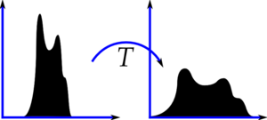
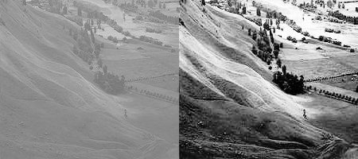
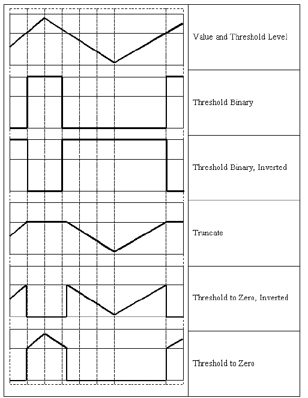
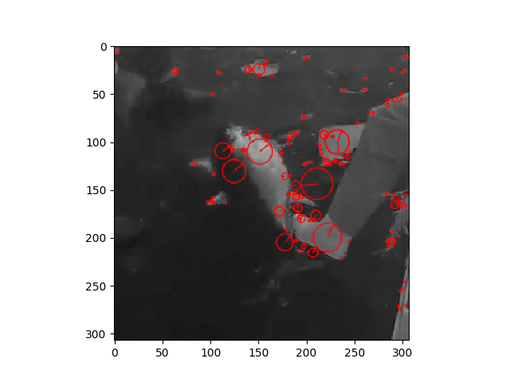

## Anatomy of an image classifier

{ width=100% }

<div class="notes">
- Many traditional computer vision image classification algorithms follow this pipeline
- Deep Learning based algorithms bypass the feature extraction step completely
</div>

# Preprocessing 

## Deskew

Align an image to a reference assits the classification algorithm 
[1](http://docs.opencv.org/trunk/dd/d3b/tutorial_py_svm_opencv.html),
[2](https://www.learnopencv.com/handwritten-digits-classification-an-opencv-c-python-tutorial/).

{ height=100% }

<div class="notes">
Il est possible d'aider l'algorithme d'apprentissage. Pour le cas de
reconnaissance de visage par exemple, aligner les images par rapport par
rapport à la position des yeux améliore les résultats.

Pour le cas de digits, aligner les numéros améliore les résultats.
L'inclination de l'écriture peut être corrigé.  Ainsi l'algorithme ne doit pas
apprendre cette variation entre les chiffres.
</div>

-------

Deskewing simple grayscale images can be achieved using image moments (distance and intensity of pixels). 

<div class="notes">
This deskewing of simple grayscale images can be achieved using image moments.
OpenCV has an implementation of moments and it comes in handy while calculating
useful information like centroid, area, skewness of simple images with black
backgrounds.

It turns out that a measure of the skewness is the given by the ratio of the
two central moments ( mu11 / mu02 ). The skewness thus calculated can be used
in calculating an affine transform that deskews the image.
</div>

```python
def deskew(img):
    m = cv2.moments(img)
    if abs(m['mu02']) < 1e-2:
        # no deskewing needed. 
        return img.copy()
    # Calculate skew based on central momemts. 
    skew = m['mu11']/m['mu02']
    # Calculate affine transform to correct skewness. 
    M = np.float32([[1, skew, -0.5*SZ*skew], [0, 1, 0]])
    # Apply affine transform
    img = cv2.warpAffine(img, M, (SZ, SZ), flags=cv2.WARP_INVERSE_MAP | cv2.INTER_LINEAR)
    return img
```
-----------

### Not that easy for fishes

{ height=50% }

## Histogram equalization

Increase image contrast using the image's histogram.

{ width=100% }

<div class="notes">
- Brighter image will have all pixels confined to high values
- But a good image will have pixels from all regions of the image
</div>

-------

Palette change by  a transformation function which maps the input pixels in
brighter region to the output pixels in full region.


```python
img = cv2.imread('wiki.jpg',0)
equ = cv2.equalizeHist(img)
res = np.hstack((img,equ)) #stacking images side-by-side
cv2.imwrite('res.png',res)
```



-------

- Histogram equalization considers the global contrast of the image
- The background contrast improves after histogram equalization, but the face
  of statue lost most of the information there due to over-brightness.

{ height=30% }
[1](http://docs.opencv.org/3.1.0/d5/daf/tutorial_py_histogram_equalization.html)


-------

### Adaptive Histogram Equalization

- Histogram is equalized inside blocks. 
- Histogram would confine to a small region (unless there is noise).
- If noise is there, it will be amplified. To avoid this, contrast limiting is applied.
- If any histogram bin is above the specified contrast limit (by default 40 in OpenCV), those pixels are clipped and distributed uniformly to other bins before applying histogram equalization. 
- After equalization, to remove artefacts in tile borders, bilinear interpolation is applied.

-------


--------

### Example using fishes

Gray scale, [doc histrogram opencv](http://docs.opencv.org/2.4/doc/tutorials/imgproc/histograms/histogram_calculation/histogram_calculation.html).

```python
# Read image
src = cv2.imread("img_07473.jpg", cv2.IMREAD_GRAYSCALE);
hist = cv2.calcHist(src,[0],None,[256],[0,256])
# Histogram equalization
equ = cv2.equalizeHist(src)
equ_hit = cv2.calcHist(equ,[0],None,[256],[0,256])
# Create a AdaptativeHistogramEqualization object
clahe = cv2.createCLAHE(clipLimit=2.0, tileGridSize=(4,4))
cl1 = clahe.apply(src)
cl1_hist = cv2.calcHist(cl1,[0],None,[256],[0,256])
```

--------


--------

### Histogram equalization for color images

- Histogram equalization is a nonlinear process.
- The concept of histogram equalization is only applicable to the intensity
  values in the image.
- Convert it to a color space where intensity is separated from the color
  information (i.e. [ **YUV** ](https://en.wikipedia.org/wiki/YUV) color space)
- Equalize the Y-channel and combine it with the other two channels.

<div class="notes">
- Histogram equalization is that it's a nonlinear process.
- we cannot just separate out the three channels in an RGB image, equalize the
  histogram separately, and combine them later to form the output image.
- The concept of histogram equalization is only applicable to the intensity
  values in the image. 
- So, we have to make sure not to modify the color information when we do this.

- In order to handle the histogram equalization of color images, we need to
  convert it to a color space where intensity is separated from the color
information.
- YUV is a good example of such a color space. Once we convert it to YUV, we
  just need to equalize the Y-channel and combine it with the other two
channels to get the output image.
- Y′ stands for the luma component (the brightness) and U and V are the
  chrominance (color) components; luminance is denoted by Y and luma by Y′ –
the prime symbols (') denote gamma compression.
</div>

---------

```python
# Read image
img = cv2.imread('img_07473.jpg')
img_yuv = cv2.cvtColor(img, cv2.COLOR_BGR2YUV) # transform to YUV
hist = cv2.calcHist(img_yuv,[0],None,[256],[0,256]) # histogram for original image
# equalize the histogram of the Y channel
img_yuv[:,:,0] = cv2.equalizeHist(img_yuv[:,:,0])
# convert the YUV image back to RGB format
img_output = cv2.cvtColor(img_yuv, cv2.COLOR_YUV2RGB)
equ_hit = cv2.calcHist(img_output,[0],None,[256],[0,256])
# Create a CLAHE object (Arguments are optional).
clahe = cv2.createCLAHE(clipLimit=10.0, tileGridSize=(4,4))
img_yuv = cv2.cvtColor(img, cv2.COLOR_BGR2YUV)
img_yuv[:,:,0] = clahe.apply(img_yuv[:,:,0])
cl1 = cv2.cvtColor(img_yuv, cv2.COLOR_YUV2RGB)
cl1_hist = cv2.calcHist(img_yuv,[0],None,[256],[0,256])
```

-------


--------

## Image thresholding

- Method of image segmentation
- If pixel value is greater than a threshold value, it is assigned one value, else it is assigned another value.

{ height=80% }

<div class="notes">
- Converts a gray-scale image into a binary image
- The two levels are assigned to pixels that are below or above the specified
  threshold value.
- If pixel value is greater than a threshold value, it is assigned one value
  (may be white), else it is assigned another value (may be black).
</div>

-------- 

```python
# Thresholding with threshold value set 127
th, dst = cv2.threshold(src,127,255, cv2.THRESH_BINARY);
cv2.imwrite("opencv-thresh-binary.jpg", dst);

# Thresholding using THRESH_TOZERO
th, dst = cv2.threshold(src,127,255, cv2.THRESH_TOZERO);
cv2.imwrite("opencv-thresh-tozero.jpg", dst);

# Thresholding using THRESH_TOZERO_INV
th, dst = cv2.threshold(src,127,255, cv2.THRESH_TOZERO_INV);
cv2.imwrite("opencv-thresh-to-zero-inv.jpg", dst);
```

--------

## Adaptive thresholding

- The algorithm calculate the threshold for a small regions of the image. 
- Different thresholds for different regions of the same image 
- Gives better results for images with varying illumination.

--------


--------

## Otsu’s Binarization 

- Automatically finds a threshold value which lies in between two peaks such
  that variances to both classes are minimum
- [Otsu]( http://www.bogotobogo.com/python/OpenCV_Python/python_opencv3_Image_Global_Thresholding_Adaptive_Thresholding_Otsus_Binarization_Segmentations.php )

<div class="notes">
But consider a bimodal image (In simple words, bimodal image is an image whose
histogram has two peaks). For that image, we can approximately take a value in
the middle of those peaks as threshold value, right ? That is what Otsu
binarization does. So in simple words, it automatically calculates a threshold
value from image histogram for a bimodal image. (For images which are not
bimodal, binarization won’t be accurate.)
</div>

--------


# Feature Extraction

## Understanding features

Find the exact location of these patches in the original image.

 

<div class="notes">
- A and B sont des surfaces plattes et sont étalés dans bcp de surfaces.
Il est difficile de trouver la location exacte de ces carrés.

- C and D sont plus simples, ils sont des bords de batiments.
Vous pouvez trouver la position approximative mais pas l'emplacement exacte.
L'image varie pas le long des bords mais ortogonalement aux bords.
Les bords sont une meilleur caracteristiques comparés aux surfaces plats.

- E and F sont des coins du batiment donc on peut les toruver facilement. 
Parce que aux coins à chaque fois que l'on deplace le carré, il va varier.
Donc les coins sont une meilleur caracteritique.
</div>

---------------

## Feature definition

- Piece of information which is relevant for solving the computational task
  related to a certain application.
- Specific structures in the image such as points, edges or objects. 
- The result of a general neighborhood operation or feature detection applied
  to the image.
- Concept is very general and the choice of features in a particular computer
  vision system may be highly dependent on the specific problem at hand.

<div class="notes">
This is the same sense as feature in machine learning and pattern
recognition generally, though image processing has a very sophisticated
collection of features.
</div>

--------------

### Feature extractor

- A feature descriptor is a representation of an image that simplifies the
  image by extracting useful information and throwing away extraneous
information.
- A feature descriptor converts an image of size `width x height x 3` (channels)
  to a feature vector. (For HOG, the input image is of size `64 x 128 x 3` and
the output feature vector is of length 3780)

<div class="notes">
The feature vector is not useful for the purpose of viewing the image. But, it
is very useful for tasks like image recognition and object detection.
</div>

-------------

## Scale-Invariant Feature Transform (SIFT)

- Extract keypoints and compute its descriptor
- Invariant to uniform scaling, orientation and illumination changes
- Orientation is assigned to each keypoint to achieve invariance to image rotation
- Descriptors are vectors of 128 values, calculated from orientation histogram over the neighbourhood, [docs.opencv](http://docs.opencv.org/master/da/df5/tutorial_py_sift_intro.html).

---------

```python
img = cv2.imread('img_00898.jpg', 0)
sift = cv2.xfeatures2d.SIFT_create()
kp = sift.detect(img)
img2 = cv2.drawKeypoints(img,kp,None,(255,0,0),4)
plt.imshow(img2)
plt.savefig("sift.png")
```



<div class="notes">
Each keypoint is a special structure which has many attributes like its (x,y) coordinates, size of the meaningful neighbourhood, angle which specifies its orientation, response that specifies strength of keypoints etc.

- Orientation: A neighbourhood is taken around the keypoint location depending
  on the scale, and the gradient magnitude and direction is calculated in that
region </div>

------------

## Speeded Up Robust Features (SURF)

- In 2006, it is a speeded-up version of SIFT.
- Rely on determinant of Hessian matrix for both scale and location.

------------

```python
img = cv2.imread('img_07473.jpg',0)
surf.setHessianThreshold(1000)
kp, des = surf.detectAndCompute(img,None)
img2 = cv2.drawKeypoints(img,kp,None,(255,0,0),4)
```


## Histogram of Oriented Gradients (HOG)

- The distribution of directions of gradients are used as features
- Gradients of an image are useful because the magnitude of gradients is large
  around edges and corners 
- The gradient removes a lot of non-essential information (e.g. constant
  colored background)

-----------------

```python
# Calculate gradient
gx = cv2.Sobel(im, cv2.CV_32F, 1, 0, ksize=1)
gy = cv2.Sobel(im, cv2.CV_32F, 0, 1, ksize=1)
# Python Calculate gradient magnitude and direction ( in degrees )
mag, angle = cv2.cartToPolar(gx, gy, angleInDegrees=True)
```

----------------


# Object detection

## Libraries

- Dlib [Object_detector](http://dlib.net/ml.html#structural_object_detection_trainer)
- Opencv [Cascade Clssfifier](http://docs.opencv.org/master/d7/d8b/tutorial_py_face_detection.html)
- Deep learning

<div class="notes">
In ImageNet Large Scale Visual Recognition Challenge (ILSVRC) of 2012, an
algorithm based on Deep Learning by Alex Krizhevsky,
Ilya Sutskever, and Geoffrey Hinton shook the computer vision world with an
astounding 85% accuracy — 11% better than the algorithm that won the second
place! In ILSVRC 2012, this was the only Deep Learning based entry. 
In 2013, all winning entries were based on Deep Learning and in 2015 multiple
Convolutional Neural Network (CNN) based algorithms surpassed the human
recognition rate of 95%.

With such huge success in image recognition, Deep Learning based object
detection was inevitable. Techniques like Faster R-CNN produce jaw-dropping
results over multiple object classes. We will learn about these in later posts,
but for now keep in mind that if you have not looked at Deep Learning based
image recognition and object detection algorithms for your applications, you
may be missing out on a huge opportunity to get better results.
</div>

# Conclusions

-------------

- Image preprocessing can significantly increase the performance of a
  classification algorithm.
- A feature descriptor represents a simplified version of an image by
  extracting useful information and throwing away extraneous information.
- Using feature description increases training speed compared with raw images.
